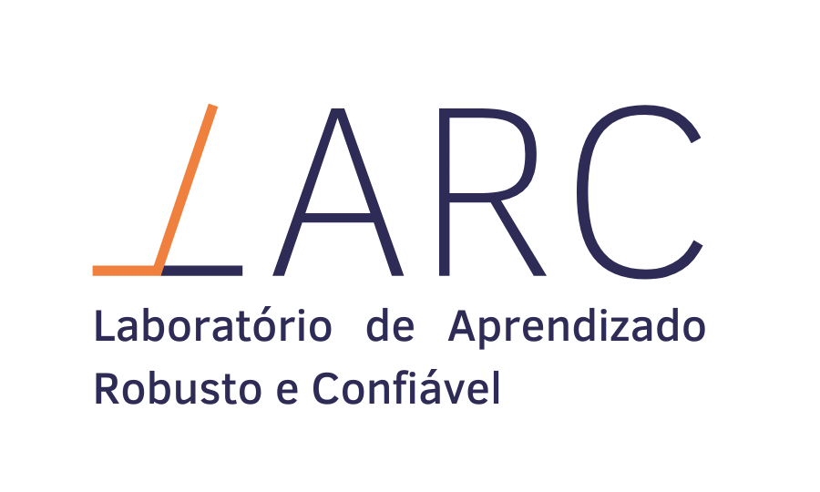
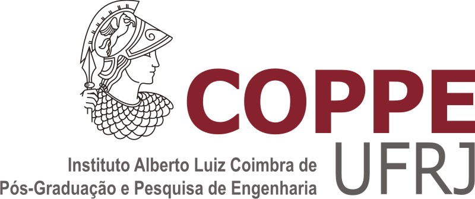

# Laboratório de Aprendizado Robusto e Confiável
PESC/COPPE/UFRJ
Prof. Geraldo Zimbrão

## Pessoas

### Prof. Geraldo Zimbrão
Coordenação Geral

### Prof. Leandro Alvim
Pesquisador colaborador

### Prof. Filipe Braida
Pós-doutorando 

### Prof. Ygor Canalli
Pós-doutorando

### Julio Barbieri
Recém doutor

### Felipe Bevilaqua
Mestrando

### Rodrigo Pagliusi
Mestrando

## Vagner do Almo
Mestrando

## Aline Coutinho
Mestranda

## Assuntos de Interesse

- 

## Publicações selecionadas

- 

